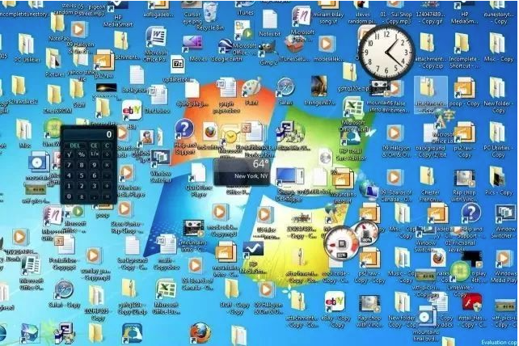
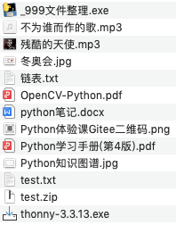
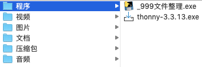

# Python体验课
---
## 为什么学习编程?
---
* 一个思维实验
	* 一个原始人
	* 一个古代人
	* 一个现代人
  
---
* 现代人的答案
	* 
  
---
* 不同点在哪?
	* 大人!时代变了!
	* 工具升级,思维升级

---
* 未来,甚至现在
	* 我们需要与**机器**交流
---
## 为什么选择Python？
---
* 近年来***最流行的语言***
	* 必然有其优势
---
*  ***最简洁语言***
	* *语法很接近人们正常交流*
---
* 门槛低但应用广上限高
	- 绘制冰墩墩,制作网站,制作游戏  
	- 大数据,科研,人工智能... 
---
- 编程语言Python本质上
	- 一个解决问题的优秀工具
	- 一个发挥创意的优秀工具
	- 开启一个新世界大门的钥匙
---
- 但重点是
	- 使用工具的人
	- 解决问题的思维
---
## 来解决个问题吧


---
- 简化下，该怎么整理它们？


---
- 分类整理好

---
- 如果有100个混乱的文件在10台电脑上？

---
- 现在我是机器人，指挥我去整理他们


---
1. 进入需整理的文件夹
2. 建立各种类文件夹？
3. 一个一个分类放到相应文件夹中？
---
```Python
# 1.以后缀名来规定如何分类文件

# 2.定位到要整理的文件夹

# 3.按照定好的规则,一个一个来建立文件夹
	# 如果已经有同名的文件夹,就不要建立
	# 如果没有,才建立

# 4.一个一个来整理文件
	# 记下当前文件的后缀名
	# 将文件的后缀与我们定义的整理规则挨个对比
		# 看看这个文件属于那个种类
			# 将其放到对应的文件夹中
```
---
## 一起动手试试吧

---
## 延伸
- 改进的地方？
- 增加功能？
- 更易用？
- 更好的逻辑流程？
- ...
 
---
## 课后
- 需要上课所用课件，源码等资源:
```
https://gitee.com/NyxJae/Python_teaching/tree/main/体验课
```


联系方式：